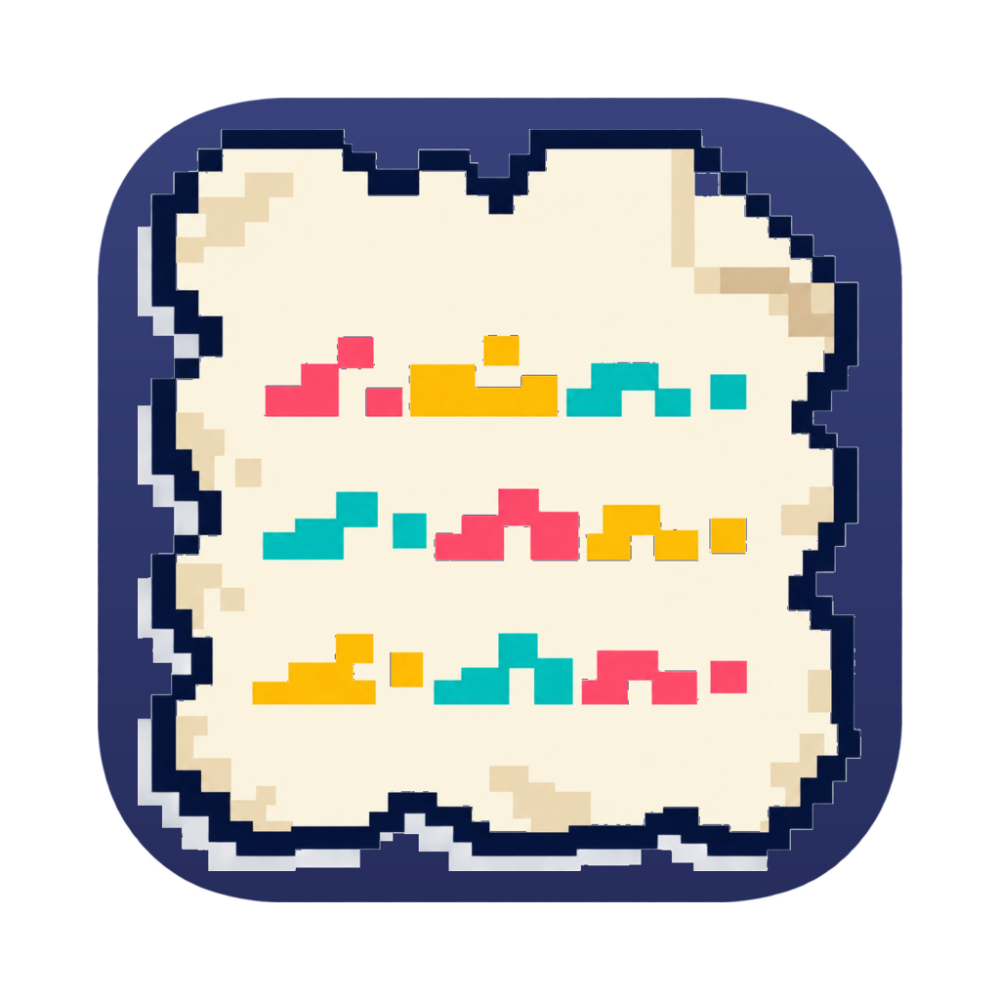
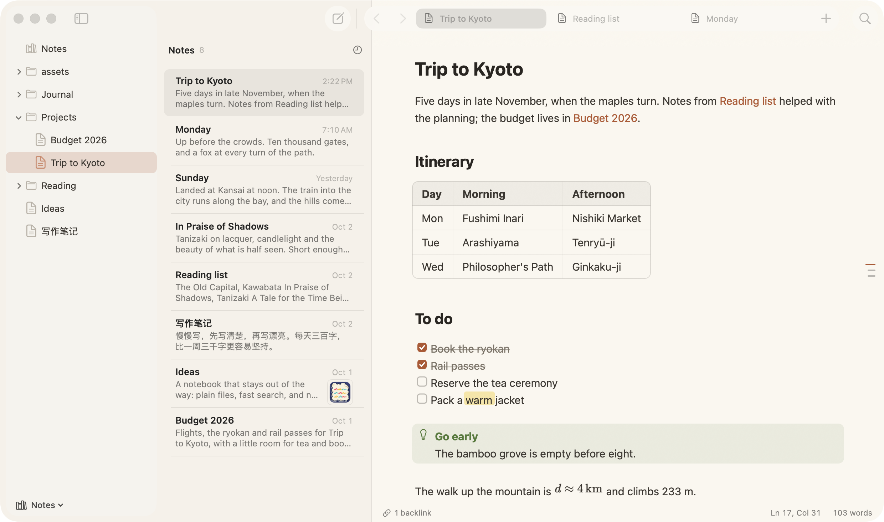

<p align="center">
  
</p>

<h1 align="center">Deckle</h1>

<p align="center">A fast, native Markdown editor for macOS.</p>

<p align="center"></p>

Deckle pairs an AppKit interface with a Rust core. Notes are plain `.md` files in a folder you choose.

> **Status:** early development. Deckle requires macOS 15 or later on Apple silicon. Download the DMG from [Releases](https://github.com/sorrycc/Deckle/releases), or build it from source. Installed copies update themselves.

## Features

- **Live styling.** Markdown is styled as you type, with syntax shown only around the selection.
- **Rich blocks.** Images, tables, KaTeX math and Mermaid diagrams render inline.
- **Extended syntax.** Wikilinks, footnotes, tasks, callouts, highlights, front matter and code highlighting in about 20 languages.
- **Workspaces.** A file tree, a note list with previews, and tabs with history.
- **Search and commands.** Quick open (⌘P), full-text search (⇧⌘F) and a command palette (⇧⌘P).
- **Backlinks.** Follow links with ⌘-click and see which notes link to the current one.
- **Typing helpers.** List continuation, a `/` block menu, note-name completion and image paste.
- **Themes.** Nine light and dark palettes with configurable fonts and line width.
- **Print and PDF export.** Output matches the editor, including math and diagrams.
- **Chinese and Japanese.** Per-line glyph forms and separate font choices for CJK text.

See the [user guide](docs/usage.md) for details.

## Requirements

- Xcode 26 or its Command Line Tools, for Swift 6.2 (they run on macOS 15.6 or later)
- Rust, installed through [rustup](https://rustup.rs)

## Build and run

```sh
scripts/bundle.sh                    # release build; pass `debug` for a debug build
open build/Deckle.app
open -a build/Deckle.app ~/Notes     # open a folder as the workspace
open -a build/Deckle.app note.md     # open a file in a tab
```

The script builds the Rust core and the Swift app, then assembles an ad-hoc signed `build/Deckle.app`. Set `DECKLE_OUT` and `DECKLE_BUNDLE_ID` to build a separate copy with its own settings.

Run the core's tests with `cargo test --release`.

## Releasing

Releases are signed with a Developer ID, notarized, and published on GitHub Releases. Installed copies update through [Sparkle](https://sparkle-project.org) from the appcast at `https://sorrycc.github.io/Deckle/appcast.xml`.

1. Run `scripts/bump.sh <version>`, such as `scripts/bump.sh 0.2.0-beta.1`, or give it `patch`, `minor`, `major` or `beta` to work the version out from the current one. It sets the version in `Cargo.toml` and `Cargo.lock`, commits that as `v<version>` and tags the commit. A version with a pre-release part, such as `0.2.0-beta.1`, is a beta: a GitHub pre-release that only copies with Settings > Updates > Include beta versions turned on are offered.
2. Answer yes when it asks to push `main` and the tag, and GitHub Actions builds and publishes the release. Or answer no, push `main`, and run `scripts/release.sh` on a Mac with the certificate, the `deckle-notary` notarytool profile, and the Sparkle key in the keychain.

`CFBundleVersion` is the commit count, so release from `main` only. `scripts/bundle.sh` writes the update feed only into Developer ID builds of the everyday bundle ID, so dev builds never update themselves.

## Project layout

| Path | Description |
|---|---|
| `core/` | Rust library: Markdown parsing, code highlighting, workspace indexing and search |
| `app/` | SwiftPM package for the AppKit app |
| `app/Sources/CDeckleCore/deckle_core.h` | C interface between the core and the app |
| `app/Resources/Bundled/` | Bundled KaTeX, Mermaid and fonts |
| `scripts/bundle.sh` | Build, packaging and signing script |
| `scripts/release.sh` | Notarizes and publishes a release and its appcast item |
| `scripts/sparkle-public-key` | Public key that installed copies check updates against |

## Documentation

- [User guide](docs/usage.md)
- [Architecture](docs/architecture.md)
- [Performance](docs/performance.md)

## License

Deckle is released under the [MIT License](LICENSE).

Deckle bundles the following third-party software:

| Component | Version | License |
|---|---|---|
| [KaTeX](https://katex.org) | 0.16.22 | [MIT](app/Resources/Bundled/Renderer/LICENSE-KaTeX.txt), © Khan Academy and other contributors |
| [Mermaid](https://mermaid.js.org) | 11.12.0 | [MIT](app/Resources/Bundled/Renderer/LICENSE-Mermaid.txt), © Knut Sveidqvist |
| [Sparkle](https://sparkle-project.org) | 2.10.0 | [MIT](https://github.com/sparkle-project/Sparkle/blob/2.x/LICENSE), © Andy Matuschak and other contributors |
| [LXGW WenKai Lite](https://github.com/lxgw/LxgwWenKai-Lite) | | [SIL Open Font License 1.1](app/Resources/Bundled/Fonts/OFL.txt), © LXGW and The Klee Project Authors |
